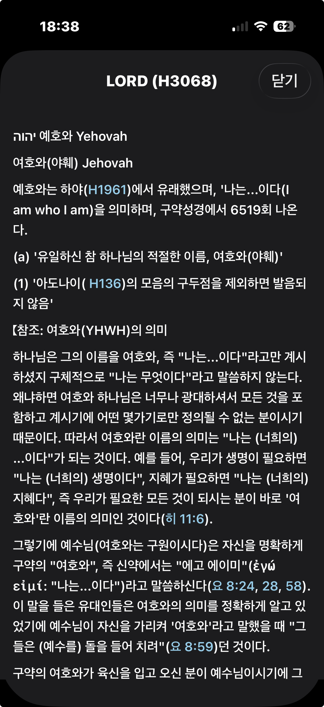

# MyStudyBible 앱 소개

오랫동안 안드로이드의 MySword 성경과 윈도우용 성경앱인 theWord를 사용해왔습니다.
그러다가 개인적인 이유로 맥과 아이폰으로 제 컴퓨터 환경이 바뀌게 되었는데, 안드로이드에서 사용하던 것만한 성경앱을 아이폰에서는 찾을수가 없었습니다.
그래서 최신 AI 를 최대한 활용해서 이렇게 아이폰/아이패드용 성경앱을 만들게 되었습니다.

결국 최대한 많은 분들이 사용할수 있게 영어도 지원하게 만들었고, 전세계 앱스토어를 통해 무료로 배포하기에 까지 이르렀습니다.
아마도 영어권 분들은 앱스토어의 소개란이 한글로 되어 있어서 언어장벽 때문에 사용을 주저하실수 있겠습니다만, 시간이 지나 좋은 앱으로 사용자분들이 인정해주시면, 소문을 통해 퍼져나가리라 생각됩니다.

그리고 이 앱에서 사용되는 대부분의 데이터들은 사용자가 직접 구해야만 하고, 앱을 설치하고 나서 생성되는 MyStudyBible 폴더 아래의 여러 폴더들에 직접 그 데이터 파일들을 복사해 넣어줘야 하는 불편함도 있습니다. 그러나 라이센스 문제를 회피하기위해서 어쩔수 없이 이런 선택을 해야만 했습니다.

참고로 아래의 네이버카페에 가시면 여러 데이터들을 조금 더 구하실수 있을겁니다.  
네이버카페: https://cafe.naver.com/thewordkor

MyStudyBible 폴더 아래의 여러 폴더들에 어떤 파일들을 넣어야 하는지 간단하게 이곳에 적어 놓겠습니다.

- **bible**: Sqlite 형식의 성경(예: *.bbl.mybible) 파일을 이곳에 넣으세요.
- **commentary**: Sqlite 형식의 주석(예: *.cmt.mybible) 파일을 이곳에 넣으세요.
- **cross_ref**: Sqlite 형식의 관주(예: *.xrefs.twm) 파일을 이곳에 넣으세요. (PC 용 앱인 theWord 에서 사용하는  default.xrefs.twm 를 넣으시거나 위에 소개한 네이버카페에서 구하실수 있는 파일을 사용하시면 됩니다.)
- **font**: 사용하길 원하는 .ttf 또는 .otf 폰트 파일을 구해서 이곳에 넣으세요. 
- **Images**: 앱 내에서 사진 접근 권한을 허용하시면, 해당 구절을 위해 선택한 사진이 자동으로 복사되어 저장되는 곳입니다. 참고로 '책이름-장번호-절번호_xxxxx' 형식으로 시작하는 이미지 파일이름이면 앱이 자동으로 불러옵니다.
- **mapdata**: Sqlite 형식의 지도 데이터 파일을 이곳에 넣으세요. 앞서 소개한 네이버 카페에서 구하실수 있습니다.
- **user_data**: 앱 내에서 생성된 사용자 노트, 하이라이트, 밑줄, 북마크, 불러온 읽기 계획표 등의 사용자 데이터가 sqlite 형식으로 저장되는 곳입니다. (이곳은 직접 구한 파일을 넣는 폴더가 아닙니다)
-**dict (MyStudyBible 2.5 버전부터 생성됩니다)**:  MySword 용 스트롱사전 데이터베이스 파일을 이곳에 넣으세요.

## 버전 히스토리

### 2.6 에서 추가된 주요 기능들
- 대조보기에서 최대 4개의 역본을 좌우로 나란히 놓고 대조해 볼 수 있습니다.  
- 밑줄 긋기 기능에서 발생하던 여러 문제점들을 수정하였습니다.  

### 2.5.5 에서 추가된 주요 기능들
- 설정창에서 주석창의 주석내용의 폰트 크기를 조절할 수 있습니다.  
- 주석 창 내용의 폰트 크기와 참조구절링크 텍스트를 탭했을때 뜨는 팝업창에서의 폰트 크기가 동일하게 설정되도록 하였습니다.  
- 주석 창에 나오는 참조구절링크 텍스트의 색깔도 설정창의 링크 텍스트 색상 설정값과 동일하게 설정되도록 하였습니다.  
- 다른 어떤 앱에서든 성경참조구절의 텍스트(예: 창 3:1-3)를 선택후 -> 공유 -> BibleVerseAction 을 누르면 해당 구절이 클립보드에 저장되도록 하였습니다.  
- 소제목에 있는 성경참조구절 텍스트를 자동으로 인식해서 링크가 가능한 텍스트로 표시합니다. 해당 링크를 눌러 팝업창에서 해당구절을 확인할 수 있습니다.  

### 2.5.1 에서 추가된 주요 기능들
2.5.1 버전은 주로 오류 수정이 대부분이고 아래와 같은 추가 기능이 들어갔습니다.  
  
- 원전분해 성경에서의 스트롱코드 링크 활성화(스트롱코드 사전 팝업)  
- 스트롱코드 사전 팝업창에서의 글자크기 설정  
- 원전분해 성경에서의 스트롱코드 링크텍스트와 스트롱코드 사전 팝업창에서의 링크 텍스트 색상이 설정창의 링크 텍스트 색상 설정값과 동일하게 하였습니다.  

### 2.5 에서 추가된 주요 기능들

##### 일부 스트롱번호가 담긴 성경을 스트롱사전과 연결해서 지원합니다.
- 새로 생성되는 MyStudyBible->dict 폴더아래에 사용자가 MySword 용 스트롱사전 파일을 저장해야 합니다.
- 제가 가진 성경이 KJV with Strong Number 여서 이 성경에서 작동하는것은 확인했습니다.
- 스트롱번호를 탭하면 MyStudyBible->dict 폴더아래에 있는 MySword 용 스트롱사전 파일을 참조해서 팝업창에 그 의미와 내용이 표시됩니다.
- 스트롱번호가 표시되는 텍스트의 색은 설정창의 링크 텍스트 색상에서 수정할수 있습니다.
- 알려진 문제: 스트롱번호가 있는 성경에서는 밑줄긋기를 했을때 스트롱번호 표시가 잘 되지 않을수 있습니다.

  
  

##### 일부 원전분해 성경을 지원합니다.
- 제가 가지고 있는 몇 개의 원전분해 성경은 잘 작동했습니다. 혹시 문제가 있는 성경은 제게 보내주시면 제가 테스트해볼 수 있습니다.
- 알려진 문제: 원전분해 성경에서는 메뉴의 기능들 대부분이 제대로 작동하지 않을수 있습니다. 뷰어로만 사용해주세요.

  
  
  
  
  

##### 인물 관계를 입력하고 관리할 수 있습니다.
- 더블 탭으로 메뉴를 열면 '인물관계 편집' 메뉴가 표시됩니다.
- 인물 관계가 저장된 구절뒤에는 인물 아이콘이 표시되고, 인물 아이콘을 탭하면 인물관계 창이 표시됩니다. 
- 인물 관계는 사용자가 직접 채워넣어야 합니다. 아이폰의 작은 화면에서 작업하기 쉽지 않아서 맥과 윈도우용 인물관계 편집기를 이곳 홈페이지를 통해 같이 배포할 예정입니다.

  
  
  
  
  

##### 맥과 윈도우용 인물관계 편집기를 같이 배포할 예정입니다.
- 복잡한 인물관계를 작은 아이폰 화면에서 편집하기 힘들때가 많아 맥과 윈도우에서 실행할수 있는 인물관계 편집기를 파이썬과 pyQT6 라이브러리를 이용해 만들었습니다. AI가 많은 도움을 주었습니다. ;-)

- [인물관계 편집기 설명서 보기](https://kleinstein.github.io/my-study-bible/#/PersonRelationshipEditor-mac)

##### 아이클라우드 드라이브를 지원합니다.
- 설정창에서 아이클라우드 동기화를 켜거나 끌수 있습니다. 
- 아이클라우드 동기화가 꺼져있으면 사용자가 앱 사용중 발생하는 모든 변경점들은 '나의 iPhone' -> MyStudyBible 폴더 아래에 저장되고 업데이트 됩니다. 
- 아이클라우드 동기화가 켜져있으면 사용자가 앱 사용중 발생하는 모든 변경점들은 '아이클라우드'->MyStudyBible 폴더 아래에 저장되고 그곳에서 업데이트 됩니다.
- 아이클라우드 동기화가 켜져있으면, 아이폰과 아이패드에서 동일한 데이터로 작업을 이어서 하는 것이 가능합니다. 왜냐하면 아이폰과 아이패드 모두 아이클라우드에 있는 동일한 데이터를 이용하고 업데이트하기 때문입니다.
물론 지역에 따라 동기화의 속도가 느릴수 있으므로 10여분 정도 기다려야 하는 일이 있을수 있습니다.  

* iCloud 동기화 켜기 시도 중 로컬 데이터와 아이클라우드 데이터간의 충돌이 발생하는 상황에서:  

  - "iCloud 데이터 사용" 선택:
    - iCloud에 있던 데이터를 그대로 사용합니다 (복사 없음)
    - 로컬 데이터는 그대로 유지됩니다
    - 앱은 iCloud 데이터를 사용하게 됩니다
  - "로컬 데이터 사용" 선택:
    - 로컬 데이터를 iCloud로 복사합니다
    - iCloud의 기존 데이터는 덮어씌워집니다
    - 앱은 iCloud 데이터를 사용하게 됩니다  

* iCloud 동기화 끄기 시도 중 로컬 데이터와 아이클라우드 데이터간의 충돌이 발생하는 상황에서:  

  - "iCloud 데이터 사용" 선택:
    - iCloud 데이터를 로컬로 복사합니다
    - 로컬의 기존 데이터는 덮어씌워집니다
    - 앱은 로컬 데이터를 사용하게 됩니다
  - "로컬 데이터 사용" 선택:
    - 로컬에 있던 데이터를 그대로 사용합니다 (복사 없음)
    - iCloud 데이터는 그대로 유지됩니다
    - 앱은 로컬 데이터를 사용하게 됩니다

### 2.3.1 에서 수정된 것들

- 언어 설정이 영어일때 일반보기, 비교보기, 대조보기 모드의 텍스트가 한글로 나오던 문제 해결.
- 일반보기 모드에서 밑줄을 수정했을때 곧바로 반영되지 않았던 문제 해결.
  
- Fixed an issue where text appeared in Korean in Normal View, Comparison View, and Contrast View modes when the language setting was English.
- Fixed an issue where changes made to underlines in Normal View Mode were not immediately reflected.

### 2.3 에서 추가된 기능들:

- 3 가지 보기 모드 추가. 비교보기와 대조보기에서는 항상 기준 성경에만 구절 뒤에 3가지 아이콘(노트, 북마크, 관주아이콘)이 표시됩니다.
- 좌우 대조 보기에서는 구절복사, 구절범위 복사, 밑줄 긋기가 더블탭한 역본에 적용됩니다. 나머지 기능은 좌측의 기본 성경을 기준으로 작동됩니다.
- 좌우 대조 보기에서는 노트 아이콘, 책갈피(북마크) 아이콘, 관주 아이콘, 지도 아이콘이 모두 좌측의 기본 성경에만 표시됩니다.
  
- Side-by-side comparison view has been added. (Please select the Bible to compare in the settings window first.)
- In side-by-side view, verse copying, verse range copying, and underlining apply to the version you double-tap. All other functions operate based on the default Bible on the left.
- In side-by-side view, the note icon, bookmark icon, cross-reference icon, and map icon all appear only on the default Bible on the left.

##### 일반보기
하나의 성경 역본만 화면에 표시됩니다.
##### 비교보기
매 구절마다, 설정에서 선택한 두 개 이상의 성경 역본들 내용이 위에서 아래로 한 구절씩 화면에 표시됩니다.
##### 대조보기
설정에서 선택한 두 개의 성경 역본이 화면 좌 우에 대조해서 표시됩니다.
