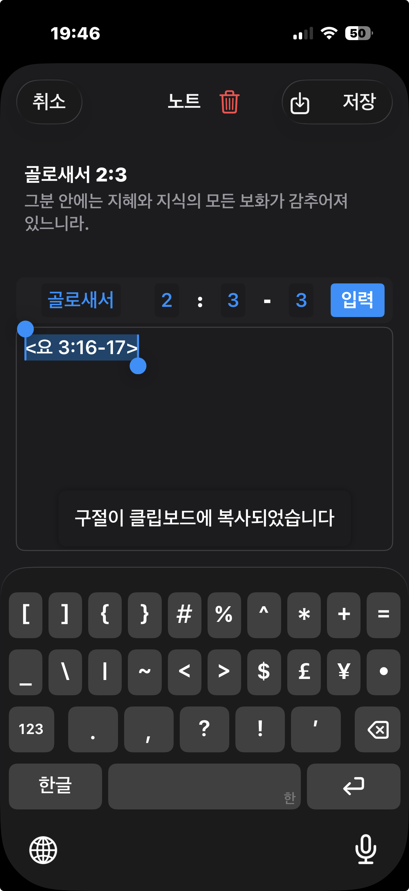
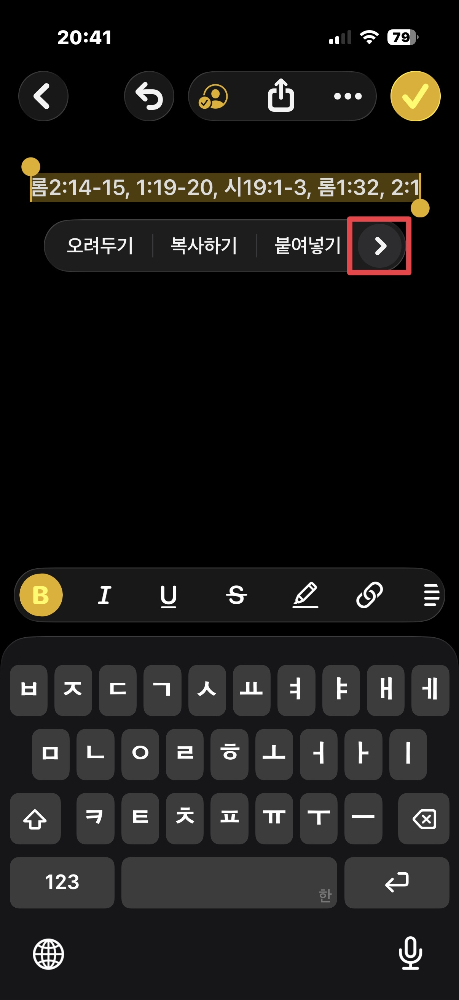

## 주석보기 창에서의 번역보기 버튼

외국어로 된 주석의 내용일때, 위에서 표시된 버튼을 누르면, 아이폰의 '번역' 앱에서 설정된 번역기를 통해 해당 내용을 한글(번역 앱에서 설정된 목표언어)로 보실수 있습니다.
  
  
## 노트 입력 창에서 빠르게 인용구절 입력하기
 
노트 입력 창에서 인용구절을 입력할때 < 책이름 장:시작절-끝절 이렇게 입력하고 
   
 
마지막으로 > 기호로 닫으면, 곧바로 < > 기호 안의 해당 구절이 클립보드에 복사가 됩니다. 
그리고 동시에 내가 입력한 < 책이름 장:절 > 부분이 자동으로 선택이 됩니다. 
 
 
그래서 간단히 백스페이스로 내가 입력했던 < 책이름 장:절 > 부분을 지우고 '붙여넣기'를 누르면 
인용구절이 붙여넣어 집니다. 
 
제 개인적으로 목사님의 설교를 듣다가 중요한 내용을 노트할때 빠르게 인용구절을 넣기위해 만든 기능입니다. 
 

## 외부 앱에서 참조 성경 구절 복사해넣기
노트 앱에서 다음과 같은 성경 참조가 있다고 해봅시다. 
 
이 성경 참조를 모두 선택하면 위에 메뉴가 뜹니다.
 
 
이 메뉴의 우측 화살표를 눌러 메뉴를 확장하면 가장 아래에 '공유' 메뉴가 뜹니다.
 
 
'공유' 메뉴를 눌렀을때 뜨는 창의 가장 아래쪽을 보면 BibleVerseAction 항목이 있습니다. 
이 항목을 선택하면 해당 참조 구절들의 내용이 클립보드에 복사가 됩니다. 
 
 
이제 노트앱에서 '붙여넣기'를 해주면 클립보드에 복사된 성경 구절들이 붙여넣어집니다. 
역본명을 앞에 넣을것인지, 뒤에 넣을 것인지, 아니면 역본 명은 제외할것인지 등등의 다양한 형식들이 있을수 있는데 
이런 형식들은 MyStudyBible의 '구절 범위 선택'창의 중간 부분에 있는 '형식 설정' 버튼을 눌러 뜨는 창에서 설정할수 있습니다. 
 
