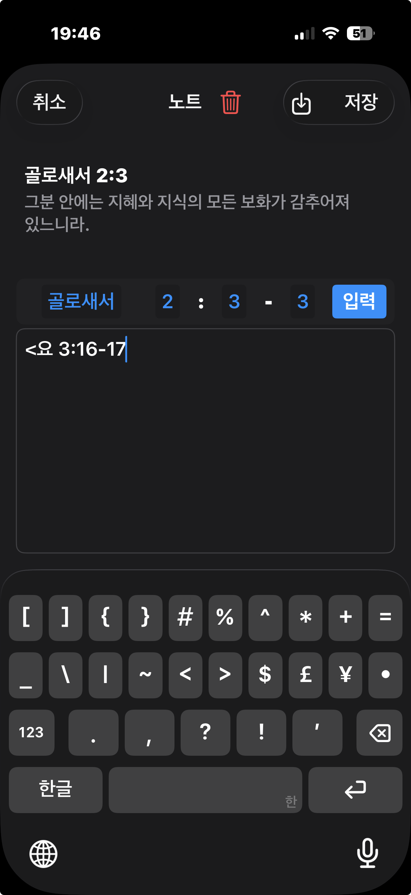

# 주석보기 창에서의 번역보기 버튼

외국어로 된 주석의 내용일때, 위에서 표시된 버튼을 누르면, 아이폰의 '번역' 앱에서 설정된 번역기를 통해 해당 내용을 한글(번역 앱에서 설정된 목표언어)로 보실수 있습니다.
  
  
# 노트 입력 창에서 빠르게 인용구절 입력하기

  
노트 입력 창에서 인용구절을 입력할때 < 책이름 장:시작절-끝절 이렇게 입력하고  
  
  
마지막으로 > 기호로 닫으면, 곧바로 < > 기호 안의 해당 구절이 클립보드에 복사가 됩니다.  
그리고 동시에 내가 입력한 < 책이름 장:절 > 부분이 자동으로 선택이 됩니다.  
  
  
그래서 간단히 백스페이스로 내가 입력했던 < 책이름 장:절 > 부분을 지우고 '붙여넣기'를 누르면  
인용구절이 붙여넣어 집니다.  
  
제 개인적으로 목사님의 설교를 듣다가 중요한 내용을 노트할때 빠르게 인용구절을 넣기위해 만든 기능입니다.  
  

