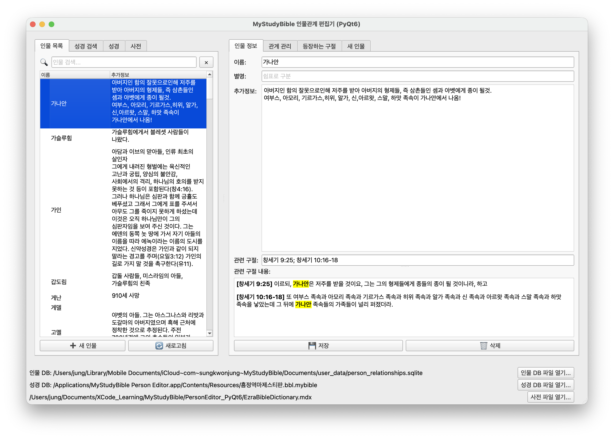
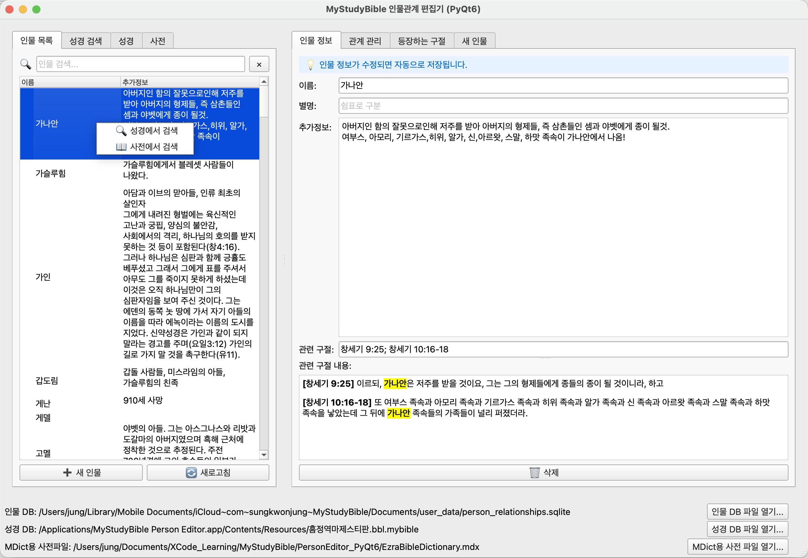
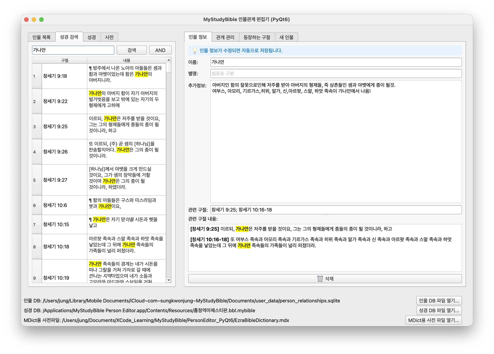
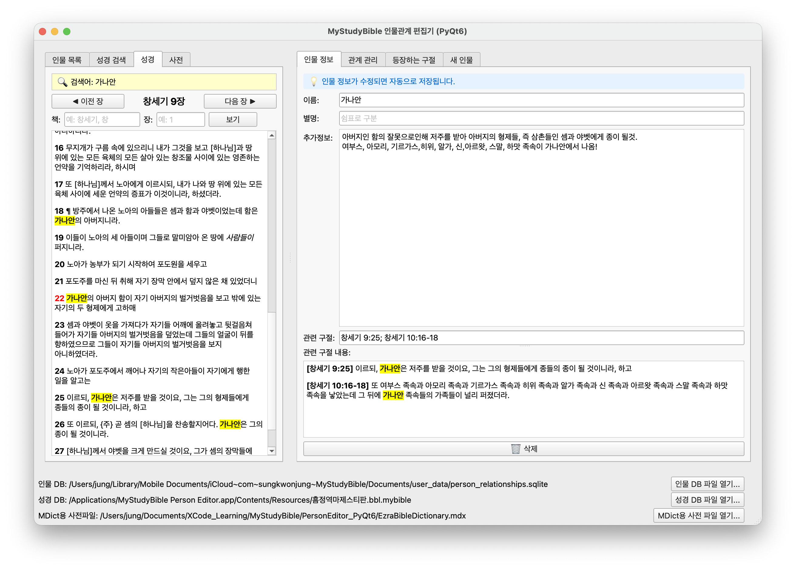
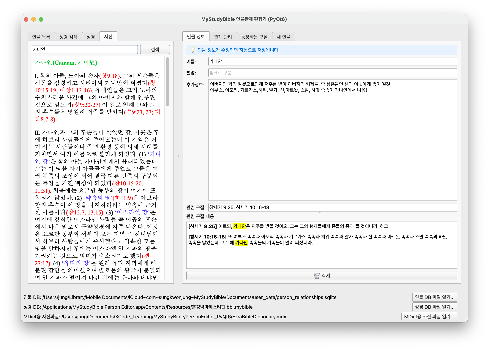
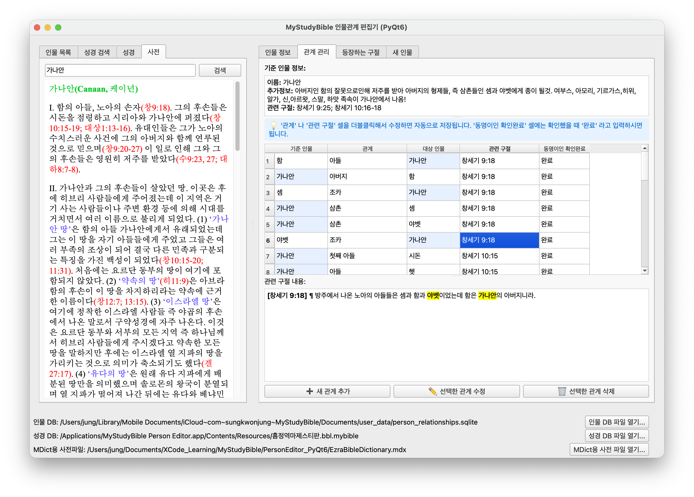
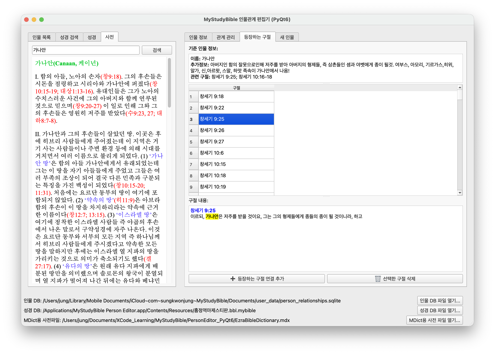
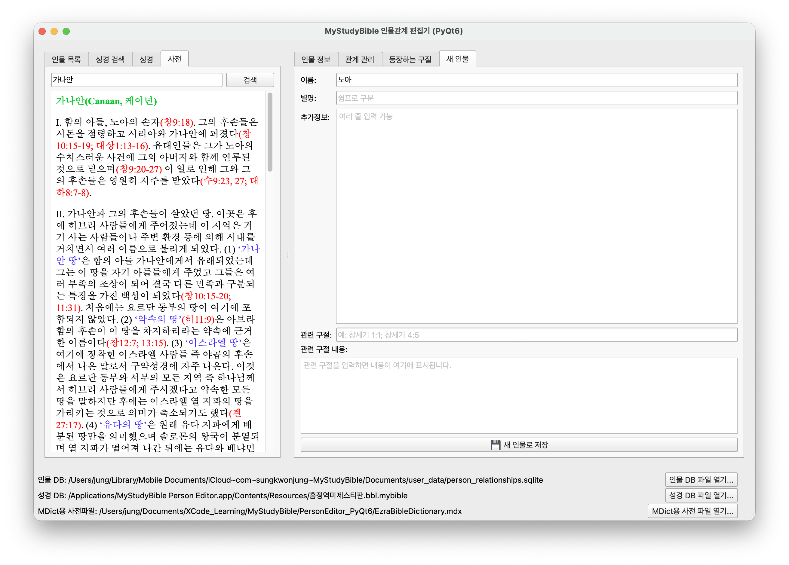
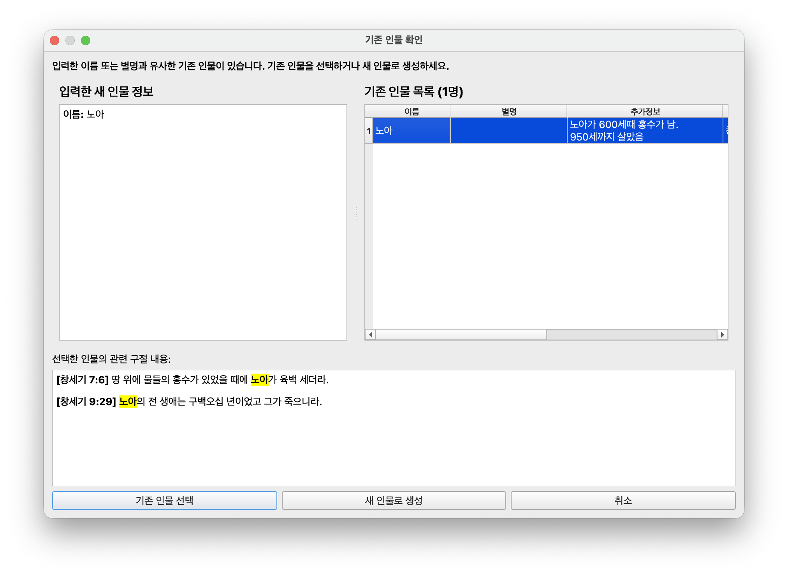

## 인물관계 편집기
  
성경에 나오는 방대한 인물들과 그 관계를 정리할때, 아이폰보다 더 넓은 화면에서 쉽게 작업할수 있게 하기위해 인물관계 편집기를 파이썬과 pyQT6 라이브러리를 이용해 만들었습니다. AI가 많은 도움을 주었습니다. ;-)  
  
인물관계 편집기에서는 3 개의 필수 추가 데이터 파일을 사용해서 MyStudyBible 에서 사용하는 user_data/person_relationships.sqlite 파일을 편집하게 됩니다.  

#### 3 개의 필수 추가 데이터 파일들
- 성경 DB 파일: MyStudyBible -> bible -> {인물관계를 정리하는데 기본이 될 성경 파일}
- MDict 포맷의 사전 데이터 (앞서 소개한 [네이버카페](https://cafe.naver.com/thewordkor)에서 구할 수 있습니다.)
- 인물 DB 파일: MyStudyBible -> user_data -> person_relationships.sqlite

#### 인물관계 편집기를 맥에서 처음 실행할 때 ⚠️ 보안 경고가 나타나는 경우

##### "개발자를 확인할 수 없습니다" 에러 해결

**방법 1: 우클릭으로 열기 (가장 쉬운 방법)**

1. Finder에서 앱을 찾습니다.
2. **Control 키를 누른 채로 클릭** (또는 우클릭)합니다.
3. **"열기"**를 선택합니다.
4. 대화상자에서 **"열기"** 버튼을 클릭합니다.

**방법 2: 시스템 설정에서 허용**

1. 앱을 실행하려고 시도합니다 (에러 메시지가 나타남).
2. **시스템 설정** > **개인정보 보호 및 보안**으로 이동합니다.
3. 하단에 "확인할 수 없는 개발자가 배포한 앱" 메시지가 표시됩니다.
4. **"확인 없이 열기"** 버튼을 클릭합니다.
5. 확인 대화상자에서 **"열기"**를 클릭합니다.

> **참고**: 이 과정은 처음 한 번만 하면 되며, 이후에는 일반적으로 앱을 실행할 수 있습니다.

> **팁**: 아이폰/아이패드에서 아이클라우드 동기화를 켠 상태에서, '아이클라우드-> MyStudyBible -> user_data -> person_relationships.sqlite' 을 인물관계 편집기에서 불러와서 작업하면 자동으로 아이폰과 동기화가 이루어져 이 편집기에서 작업한 내용을 아이폰/아이패드에서 볼 수 있게 됩니다.  
  
> **주의할 점** :관련 구절을 입력하실때에는 책이름과 장숫자 사이를 한칸 띄우시고 입력해주세요. 그리고 여러 구절일때는 ; 기호로 나누시면 됩니다. 예) 창 3:1-4;사 3:1  
> 시간이 되면 좀 더 편하게 입력할수 있도록 수정해서 이곳에 다시 올리겠습니다.  
  
메인화면 스크린샷:

### 왼쪽 탭들
##### 인물 목록
- 현재 person_relationships.sqlite 파일에 저장되어 있는 모든 인물들이 리스트로 표시됩니다.
- 인물의 이름 위에서 마우스 우클릭을 하면 '성경에서 검색', '사전에서 검색'을 곧바로 실행할수 있습니다.
- **인물 목록에서 선택한 인물이** 이 편집기에서는 **항상 기준 인물** 역할을 합니다. 

##### 성경 검색
- 성경에서 입력한 단어로 검색을 합니다.
- AND 버튼을 누르면 OR 버튼으로 바뀌고 이를 통해, 모든 단어가 들어간 구절(AND)이나 한 단어라도 들어간 구절(OR)을 검색할수 있습니다.
- 검색 결과에서 성경의 '책 장:절' 표시위에서 더블클릭을 하면 성경탭이 자동으로 열리면서 해당 구절이 표시됩니다.

##### 성경
- 메인 화면 아래에 표시된 성경의 내용이 표시됩니다.
- 성경의 장 전체가 표시됩니다.
- 원하는 장으로 가기위해 책이름과 장을 넣으면 해당 장으로 이동하실수 있습니다.
- 아래의 스크린샷은 성경 검색 결과에서 더블클릭을 통해 자동으로 열린 성경 구절 부분입니다.

##### 사전
- 메인 화면 아래에 표시된 사전의 내용이 표시됩니다.
- 현재 '에스라 성경 사전'이 인물관계 편집기에 기본 내장되어 있습니다.
- MDict 용 사전(확장자 .mdx)을 지원합니다.

### 오른쪽 탭들
##### 인물 정보
- **왼쪽의 인물 목록 탭에서 선택된 인물에 대한 정보가 나오는 창입니다.**
- 이곳에서 내용을 수정하면 자동으로 즉시 저장됩니다.
- 이곳에서 인물을 삭제하면 이 인물과 관계된 모든 관계들도 삭제됩니다.

##### 관계 관리
- **왼쪽의 인물 목록 탭에서 선택된 인물과 관계가 있는 모든 관계가 나오는 창입니다.**
- 인물 사이의 관계란 항상 양방향의 관계라서 양방향 관계를 모두 관리하는게 나중에 관계를 추적할때 좋습니다.
- **기준 인물** 과 **대상 인물** 이 있어서 누가 기준인가에 따라, 예를 들면 {기준인물}의 '아들'이 {대상인물}의 형식으로 표시됩니다.
- 현재 선택된 기준 인물은 푸른색 바탕으로 표시되어 알아보기 쉽게 했습니다.
- 두 인물간의 관계를 알게해주는 관련구절을 입력하면 나중에 인물 관계를 확인하기 좋습니다. 

##### 등장하는 구절
- **왼쪽의 인물 목록 탭에서 선택된 인물**이 등장하는 모든 구절들이 표시됩니다.

##### 새 인물
- 새로운 인물을 저장하고 싶을때 사용됩니다.

- 새로운 인물에 대한 정보들을 입력하고 '새 인물로 저장' 버튼을 눌렀을때, 자동으로 이미 저장되어 있는 인물과 동명이인인지 체크하는 창이 뜨게됩니다. 이 창에서 새 인물로 저장할지, 아니면 기존의 저장된 인물과 동일인물인지 확인한 후 선택합니다.

