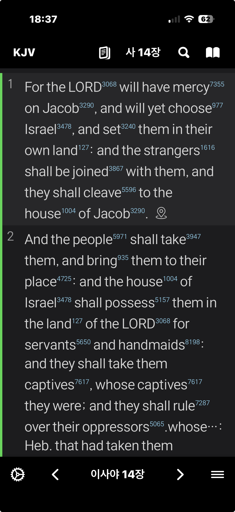
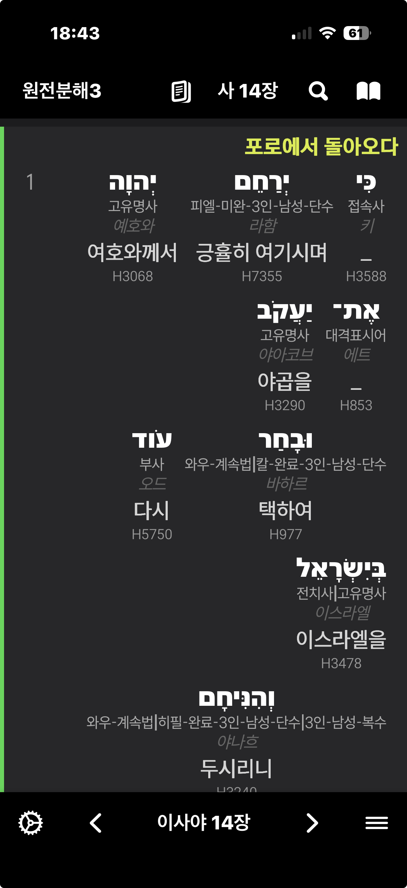
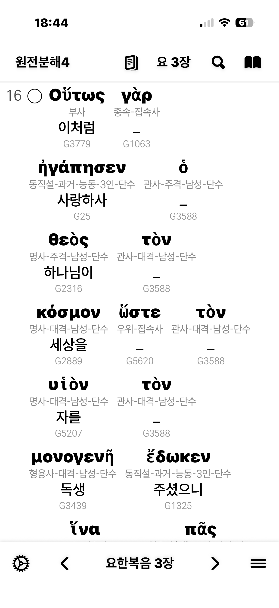
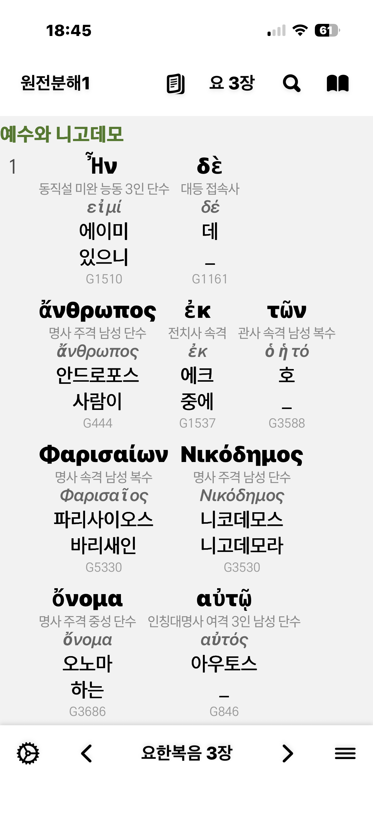
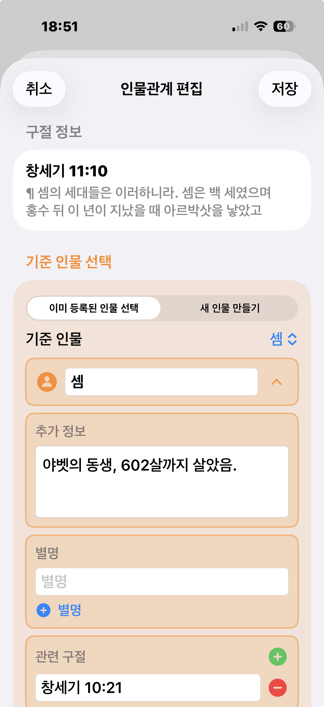

# MyStudyBible 앱은 아이폰 전용 앱입니다.

지금 홈페이지 내용을 업데이트 중입니다.

## 시작하기

[앱스토어 다운로드](https://apps.apple.com/us/app/mystudybible/id6743988874)

## 버전 히스토리

### 2.4 에서 추가된 주요 기능들 (곧 업데이트 예정)
현재 테스트 중에 있습니다. 조만간 업데이트 예정입니다.

##### 일부 스트롱번호가 담긴 성경을 스트롱사전과 연결해서 지원합니다.
- 새로 생성되는 MyStudyBible->dict 폴더아래에 사용자가 MySword 용 스트롱사전 파일을 저장해야 합니다.
- 제가 가진 성경이 KJV with Strong Number 여서 이 성경에서 작동하는것은 확인했습니다.
- 스트롱번호를 탭하면 MyStudyBible->dict 폴더아래에 있는 MySword 용 스트롱사전 파일을 참조해서 팝업창에 그 의미와 내용이 표시됩니다.
- 스트롱번호가 표시되는 텍스트의 색은 설정창의 링크 텍스트 색상에서 수정할수 있습니다.
- 알려진 문제: 스트롱번호가 있는 성경에서는 밑줄긋기를 했을때 스트롱번호 표시가 잘 되지 않을수 있습니다.

  
  

##### 일부 원전분해 성경을 지원합니다.
- 제가 가지고 있는 몇 개의 원전분해 성경은 잘 작동했습니다. 혹시 문제가 있는 성경은 제게 보내주시면 제가 테스트해볼 수 있습니다.
- 알려진 문제: 원전분해 성경에서는 메뉴의 기능들 대부분이 제대로 작동하지 않을수 있습니다. 뷰어로만 사용해주세요.

  
  
  
  
  

##### 인물 관계를 입력하고 관리할 수 있습니다.
- 더블 탭으로 메뉴를 열면 '인물관계 편집' 메뉴가 표시됩니다.
- 인물 관계가 저장된 구절뒤에는 인물 아이콘이 표시되고, 인물 아이콘을 탭하면 인물관계 창이 표시됩니다. 

  
  
  
  
  

##### 맥과 윈도우용 인물관계 편집기를 같이 배포할 예정입니다.
- 복잡한 인물관계를 작은 아이폰 화면에서 편집하기 힘들때가 많아 맥과 윈도우에서 실행할수 있는 인물관계 편집기를 파이썬과 pyQT6 라이브러리를 이용해 만들었습니다. AI가 많은 도움을 주었습니다. ;-)

##### 아이클라우드 드라이브를 지원합니다.
###### 설정창에서 아이클라우드 동기화를 켜거나 끌수 있습니다. 
- 아이클라우드 동기화가 꺼져있으면 사용자가 폴더에 복사해 넣은 모든 파일들은 '나의 iPhone' -> MyStudyBible 폴더 아래에 모두 저장되고 업데이트 됩니다. 
- 아이클라우드 동기화가 켜져있으면 '나의 iPhone' -> MyStudyBible 폴더 아래의 모든 파일들의 '아이클라우드'->MyStudyBible 폴더로 복사되고 그곳에서 업데이트 됩니다.

### 2.3 에서 추가된 주요 기능들
3 가지 보기 모드 추가. 비교보기와 대조보기에서는 항상 기준 성경에만 구절 뒤에 3가지 아이콘(노트, 북마크, 관주아이콘)이 표시됩니다.
##### 일반보기
하나의 성경 역본만 화면에 표시됩니다.
##### 비교보기
매 구절마다, 설정에서 선택한 두 개 이상의 성경 역본들 내용이 위에서 아래로 한 구절씩 화면에 표시됩니다.
##### 대조보기
설정에서 선택한 두 개의 성경 역본이 화면 좌 우에 대조해서 표시됩니다.
