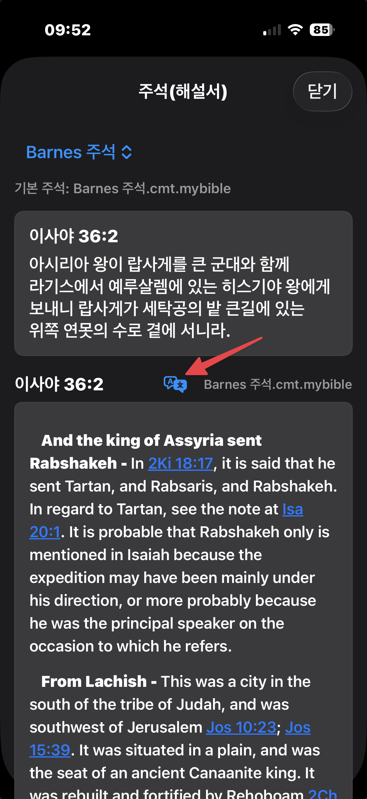

## 주석보기 창에서의 번역보기 버튼


외국어로 된 주석의 내용일때, 위에서 표시된 버튼을 누르면, 아이폰의 '번역' 앱에서 설정된 번역기를 통해 해당 내용을 한글(번역 앱에서 설정된 목표언어)로 보실수 있습니다.
  
  
## 노트 입력 창에서 빠르게 인용구절 입력하기
<br>
노트 입력 창에서 인용구절을 입력할때 < 책이름 장:시작절-끝절 이렇게 입력하고<br>
<br>  
<br>
마지막으로 > 기호로 닫으면, 곧바로 < > 기호 안의 해당 구절이 클립보드에 복사가 됩니다.<br>
그리고 동시에 내가 입력한 < 책이름 장:절 > 부분이 자동으로 선택이 됩니다.<br>
<br>
<br>
그래서 간단히 백스페이스로 내가 입력했던 < 책이름 장:절 > 부분을 지우고 '붙여넣기'를 누르면<br>
인용구절이 붙여넣어 집니다.<br>
<br>
제 개인적으로 목사님의 설교를 듣다가 중요한 내용을 노트할때 빠르게 인용구절을 넣기위해 만든 기능입니다.<br>
<br>

## 외부 앱에서 참조 성경 구절 복사해넣기
노트 앱에서 다음과 같은 성경 참조가 있다고 해봅시다.<br>
<br>
이 성경 참조를 모두 선택하면 위에 메뉴가 뜹니다.
<br>
<br>
이 메뉴의 우측 화살표를 눌러 메뉴를 확장하면 가장 아래에 '공유' 메뉴가 뜹니다.
<br>
<br>
'공유' 메뉴를 눌렀을때 뜨는 창의 가장 아래쪽을 보면 BibleVerseAction 항목이 있습니다.<br>
이 항목을 선택하면 해당 참조 구절들의 내용이 클립보드에 복사가 됩니다.<br>
<br>
<br>
이제 노트앱에서 '붙여넣기'를 해주면 클립보드에 복사된 성경 구절들이 붙여넣어집니다.<br>
역본명을 앞에 넣을것인지, 뒤에 넣을 것인지, 아니면 역본 명은 제외할것인지 등등의 다양한 형식들이 있을수 있는데<br>
이런 형식들은 MyStudyBible의 '구절 범위 선택'창의 중간 부분에 있는 '형식 설정' 버튼을 눌러 뜨는 창에서 설정할수 있습니다.<br>
<br>

## 리딩 플랜 불러오기 및 사용법
MyStudyBible은 다양한 리딩플랜을 사용자가 직접 작성해서 csv 포맷 파일로 저장하면, 이를 불러와서 사용할수 있도록 하였습니다.<br>
누구든지 자신만의 리딩플랜을 만들어 사용할수 있게 하기 위함입니다.<br>
<br>
MyStudyBible 앱은 처음에 설치하면 성경의 순서대로 1년에 1독을 하는 리딩플랜 파일(리딩플랜 목차순.csv)과 성경의 사건 시간순으로 1년에 1독을 하는 리딩플랜 파일(리딩플랜 연대순-신약추가.csv)을 같이 제공합니다.<br>
<br>
설치된 MyStudyBible 폴더 아래 user_data 폴더안에 들어있습니다.<br>
<br>

##### 리딩 플랜 CSV 파일 작성법
csv 포맷 파일이란건 일반 텍스트 파일인데, 내부에는 콤마(,)를 이용해서 내용을 분리해서 저장한 파일을 말합니다.<br> 
위에서 언급한 두 개의 리딩플랜 파일중 아무 파일이나 일반 텍스트뷰어로 열어보면 그 내용이 아래와 같이 나오는걸 확인할수 있습니다.<br>
<br>
여기서 예를 들어 가장 첫 줄에 적힌 1,1,창 1-3,마 1 가 무슨뜻이냐면<br>
1월 1일에는 창세기 1-3장과 마태복음 1장을 읽겠다는 의미입니다.<br>
<br>
즉 첫번째 숫자가 달을 뜻하고, 두번째 숫자는 일자, 세번째 이후는 해당 날짜에 읽을 성경을 콤마(,) 로 구분해서 적어준겁니다.<br>
해당 날짜에 여러 성경을 읽고 싶다면 당연히 콤마(,) 로 구분해서 계속 적어주기만 하면 됩니다.<br>
<br>
한가지 주의할 것은 책과 책의 경계를 넘어서서 한 덩어리로 적어서는 안됩니다.<br>
예를 들어 마 28:17-막 1:3 이런식으로 마태복음의 마지막 부분과 마가복음의 시작부분을 하나의 덩어리로 입력해주면 안됩니다. 이럴때는 마 28:17-20, 막 1:1-3 이렇게 구분해서 적어주면 됩니다.<br>
<br>

##### 리딩 플랜 불러오기
이렇게 작성된 csv 파일이 있으면 이제 이걸 MyStudyBible 앱의 설정창에서 불러올수 있습니다.<br>
설정창의 '성경 읽기 계획' 섹션에서 '성경 읽기 계획 관리하기'창을 열어줍니다.<br>
여기에는 현재 등록되어 있는 모든 리딩 플랜들이 나옵니다.<br>
<br> 
가장 아래의 '새 리딩 플랜 가져오기' 버튼을 눌러줍니다.<br>
<br>
<br>
그리고 여기서 화면 하단의 'CSV 파일 선택' 버튼을 누르면 파일 선택 창이 뜨는데, 여기서 앞서 작성한 CSV 파일이나 혹은 MyStudyBible에서 기본으로 제공하는 CSV 파일을 선택해 줍니다.<br>
그러면 자동으로 CSV 파일을 불러와서 '성경 읽기 계획 관리하기'창에 등록해줍니다.<br>
'성경 읽기 계획 관리하기'창에서 이제 원하는 리딩 플랜을 '기본으로' 선택해 줍니다.<br>
이렇게 '기본으로' 선택해주어야만 MyStudyBible의 성경보기 창 우측 상단의 책 모양 아이콘을 눌렀을때 해당 리딩플랜의 오늘 읽을 내용을 바로 볼수있게 됩니다.<br>
<br>
이제 여러분이 원하시는 리딩플랜을, 기본으로 주어진 CSV 를 마음껏 편집하셔서 여러분만의 리딩플랜으로 만들어 사용하시면 됩니다.<br>
참고로 등록된 리딩플랜을 지우기 원하실때는 해당 리딩플랜을 꾹 누르고 있으면 지우기 버튼이 뜹니다. 이걸 누르시면 지워지게 됩니다. 다만 이렇게 지우면 CSV 파일도 같이 지워질수 있으니까 CSV 파일은 미리 백업해 두세요.<br>
<br>
혹시 리딩플랜 파일이 MyStudyBible 앱 설치때에 같이 복사가 되지 않은 경우 아래의 CSV 파일들을 다운받으셔서 불러오기하시면 됩니다.<br>
<br>

[리딩 플랜 파일 다운받기 (연대순-신약추가)](https://raw.githubusercontent.com/kleinstein/my-study-bible/main/reading_plan_files/리딩%20플랜%20연대순-신약추가.csv)<br>
[리딩 플랜 파일 다운받기 (목차순)](https://raw.githubusercontent.com/kleinstein/my-study-bible/main/reading_plan_files/리딩%20플랜%20목차순.csv)<br>
[reading plan file download (biblical order)](https://raw.githubusercontent.com/kleinstein/my-study-bible/main/reading_plan_files/reading%20plan%20In%20biblical%20order.csv)
<br>


## 베들레햄 성경 데이터를 MyStudyBible 데이터로 변환하기
베들레햄 성경 데이터는 Sqlite 라는 포맷으로 되어 있습니다.<br>
이런 포맷은 맥/윈도우용 무료 앱인 [DB Browser for SQLite](https://sqlitebrowser.org/) 라는 편집기로 열어서 편집할수 있습니다.<br>
베들레햄 성경 데이터 파일을 위의 편집기로 열어서 보시면 아래와 같은 화면을 보실수 있습니다.
<br> 
<br>
화살표에 표시한 Browse Data 라는 탭을 클릭하면 아래와 같은 화면을 보시게 됩니다.
<br> 
<br>
위의 화면은 이미 'Scripture' 라는 열의 이름으로 잘 바뀌어진 상태이지만, 베들레햄 성경은 아마 'Text' 라는 열의 이름으로 되어 있을겁니다.<br>
이 열의 이름(Text)을 'Text' 가 아닌 'Scripture' 라는 이름으로 바꿔주셔야 합니다.<br>
이를 위해서는 아래의 그림과 같이 "Execute SQL" 이라는 탭으로 가셔서,<br>
<br> 
<br>

```
ALTER TABLE Bible RENAME COLUMN Text TO Scripture;
```
라는 명령을 입력하시고 화살표로 표시한 플레이 버튼을 눌러주시면 됩니다.<br>
그리고 난 다음 역시 화살표로 표시한 "Write Changes" 버튼을 꼭 반드시 누르셔야 합니다. 중요!!<br>
<br>
그런다음 [DB Browser for SQLite](https://sqlitebrowser.org/) 는 닫아주시고 해당 파일의 확장자를 sqlite 로 바꿔주시면 이제부터 MyStudyBible의 bible 폴더 아래로 복사만 해주시면 사용하실수 있게됩니다.<br>


